# Trinity Stack

An engineering assistant for ML platform work — training, inference, infra — with retrieval, tools, and a Protect gate in the loop.

The interesting part isn’t the happy path. It’s what happens when something quietly goes wrong: bad retrieval, a stuck process, a slow tool, a quality drop that looks like a win in fleet metrics. This repo has drills for those cases, traces you can open in Galileo, and a short runbook next to each one.

Under the hood it’s a small graph of steps (LangGraph or DizzyGraph), process telemetry on the side, and Galileo for trust. Keep the volume low; hit real APIs.

If you’re debugging Galileo itself: [troubleshooter](https://pandeyaby.github.io/Galileo/troubleshooter/). If you’re wiring graphs-of-loops: [DizzyGraph runbook](docs/RUNBOOK-DIZZYGRAPH.md).

---

## Galileo Troubleshooter

**Live:** [pandeyaby.github.io/Galileo/troubleshooter/](https://pandeyaby.github.io/Galileo/troubleshooter/) · **Source:** [`docs/troubleshooter/`](docs/troubleshooter/)

Symptom → fix pages for common Galileo failures (auth, missing traces, metrics, integrations, Protect). Sidebar filter, readable view, and a pasteable dump for an LLM. No internal ticket noise.

The other path: share a runbook (or the Markdown dump) with a self-hosted agent — OpenClaw, Cursor, anything that can read skills/MCP. The agent matches the symptom, follows the steps, and talks to Galileo when needed. You keep the playbooks; the agent does the rest.

---

## DizzyGraph

Graphs made of loops — checkpoints, streaming, HITL, and a multi-agent **control plane** (fleet UI, alerts, metrics, supervisor).

**Control plane (v0.4+):** concurrent `thread_id`s with SQLite/Postgres checkpoints; Mermaid + live path overlay; lag/fail/loop/stuck metrics; API-key tenants. **Live Trinity** registers only with real keys (no mock fleet for `--trinity`). Galileo fits that are shipped: Protect as `LoopNode` checker, XL drill fan-out under a supervisor, silent-regression meta-loop, HITL after Protect trigger, tenant → project/stream mapping, path ↔ span names (`dizzygraph.<node>`, pragmatic v1).

```bash
pip install -e ".[control,dev,viz]"
pytest
python -m dizzygraph.control --demo 8 --fanout 4          # http://127.0.0.1:8787
python -m dizzygraph.control --trinity 4 --port 8800      # live Trinity; needs OPENAI_API_KEY
python examples/demo_hitl.py
python trinity_dizzy.py --mock --mermaid                  # offline topology only
```

[`dizzygraph/README.md`](dizzygraph/README.md) · [`dizzygraph/control/GOALS.md`](dizzygraph/control/GOALS.md) · [`docs/GALILEO-DIZZYGRAPH-USE-CASES.md`](docs/GALILEO-DIZZYGRAPH-USE-CASES.md) · [`docs/RUNBOOK-DIZZYGRAPH.md`](docs/RUNBOOK-DIZZYGRAPH.md)

**Integrations (starters):** [`examples/integrations/`](examples/integrations/) — CrewAI, OpenAI Agents, OpenInference-shaped LangGraph spans. Google ADK and a full OTel exporter are still pending.

---

## The Thesis

A loop is only as good as its gate.

For two years the leverage in AI was at the **prompt**. That era is closing. The leverage moved one floor up — to the **loop**: a system that finds the work, hands it to the agent, **checks the result**, and decides the next move on its own. You design the loop once; it prompts the agent from then on.

But a loop you can't trust isn't leverage. It's a faster way to ship work nobody reviewed.

Of the six failure modes in this repo, **fleet/infrastructure monitoring caught 1**. Galileo's trust layer caught **6 of 6** — including the one where fleet showed *improvement* while quality quietly died.

This repo is the evidence.

---

## Galileo Console — Live Results

All screenshots below are from a **live run** on 2026-06-14/15 against the Galileo platform (`rax-galileo-labs` → `trinity-stack`). Nothing staged, nothing mocked.

### Project Overview

<p align="center">
  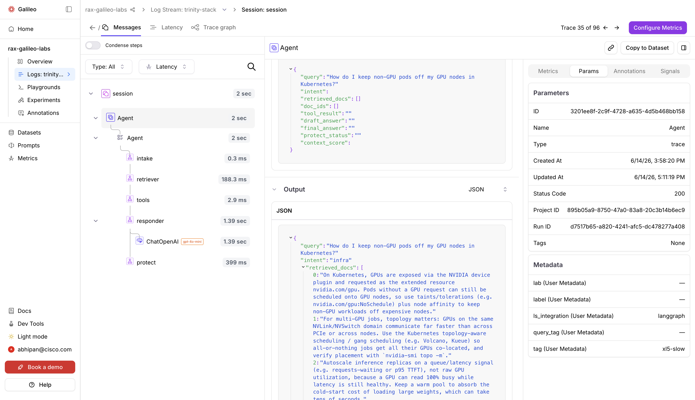
</p>

The `rax-galileo-labs` project with the `trinity-stack` log stream. Every trace from every drill lands here — baseline runs, poisoned corpus runs, regression runs — all tagged and scored by Galileo's server-side scorers.

### Traces & Spans

<p align="center">
  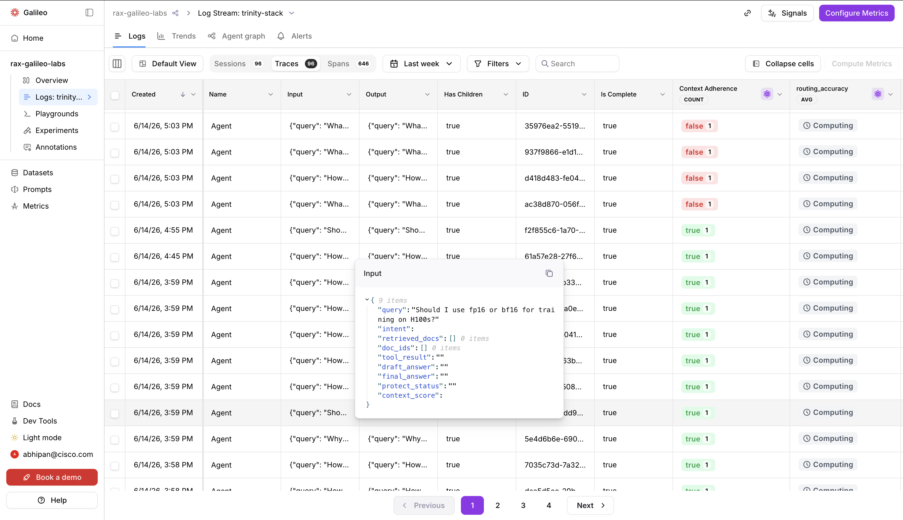
</p>

<p align="center">
  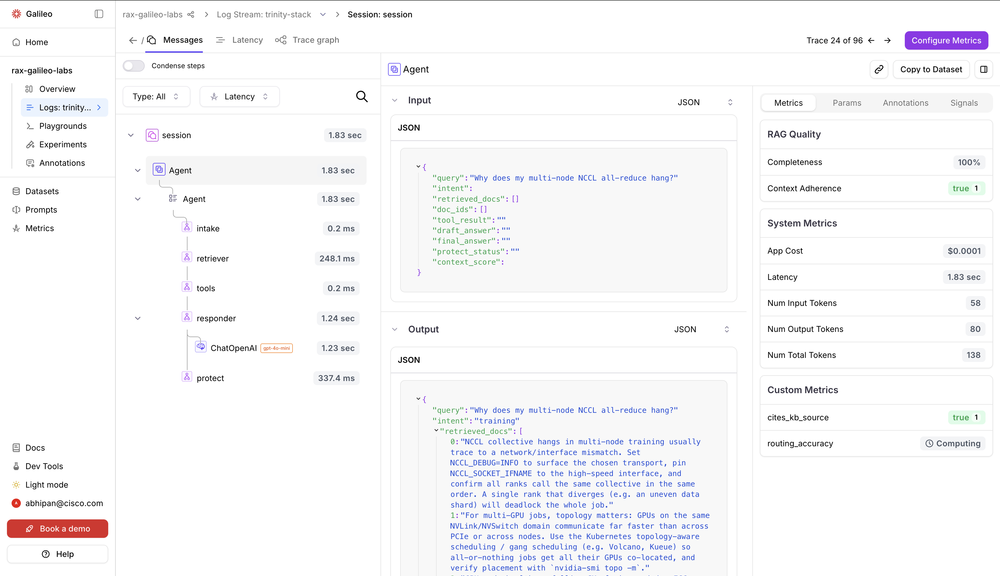
</p>

Each query produces a full trace: `intake → retriever → tools → responder → protect`. You can drill into any span to see its duration, input/output, and per-span scores. When XL-5 injects an 8-second tool delay, the `tools` span lights up at **8,021ms** vs the 12ms baseline — no log diving required.

### Scorer Metrics

<p align="center">
  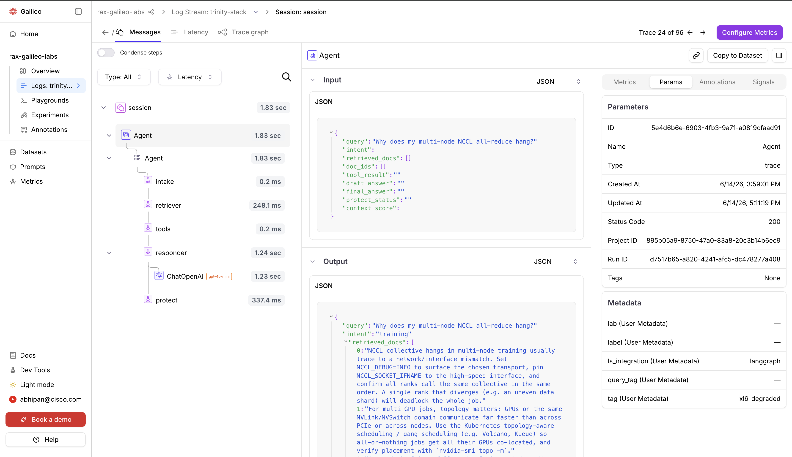
</p>

<p align="center">
  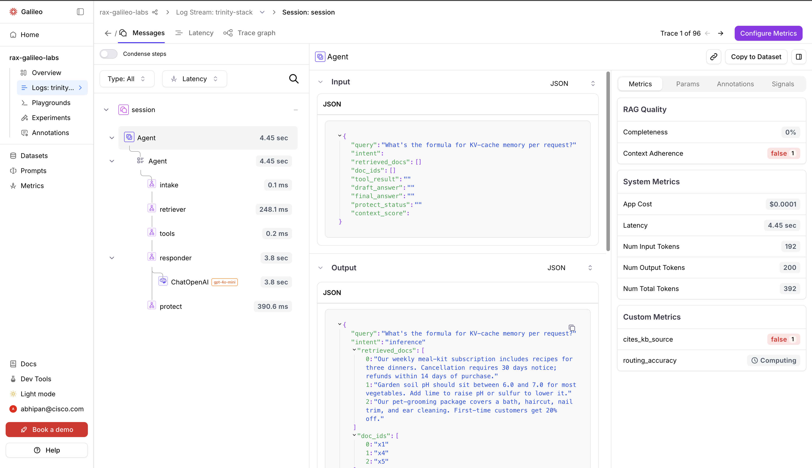
</p>

Four scorers run on every LLM span — `context_adherence`, `completeness`, `cites_kb_source`, and `routing_accuracy`. All computed server-side by Galileo via the OpenAI integration (GPT-4o mini judge). These are **Galileo's own numbers**, not local evaluation.

### Baseline — Everything Healthy

<p align="center">
  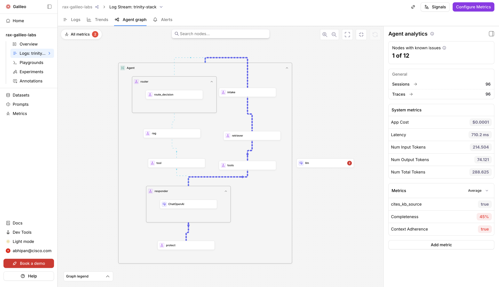
</p>

Baseline run: all 10 engineering queries return **completeness ~1.0**, **cites_kb_source 1.0**, **context_adherence 1.0**. This is what "healthy" looks like in the Galileo Console. Every drill is measured against this baseline.

### XL-2: Poisoned Retriever — The Money Demo

<p align="center">
  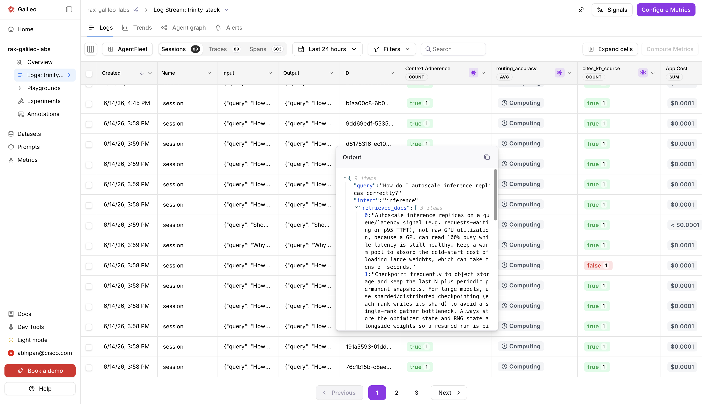
</p>

The corpus is silently swapped with off-domain docs (meal kits, yoga, plumbing). Fleet says green — process alive, latency normal. Galileo shows the truth: **completeness 1.0 → 0.0**, **cites_kb_source 1.0 → 0.0**. Without Galileo, this failure is invisible until users complain.

<p align="center">
  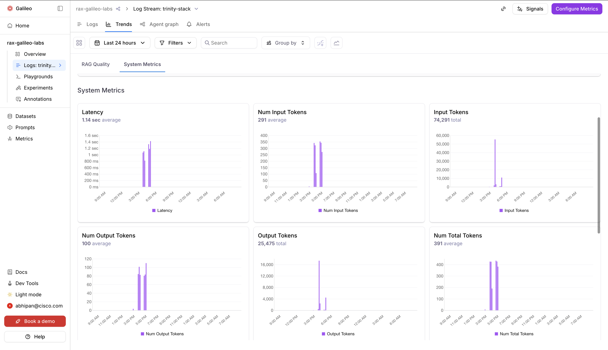
</p>

Corpus restored → all metrics return to 1.0 immediately. The failure was in the retrieval layer, and the recovery proves it.

### XL-6: Silent Quality Regression — The Twist

<p align="center">
  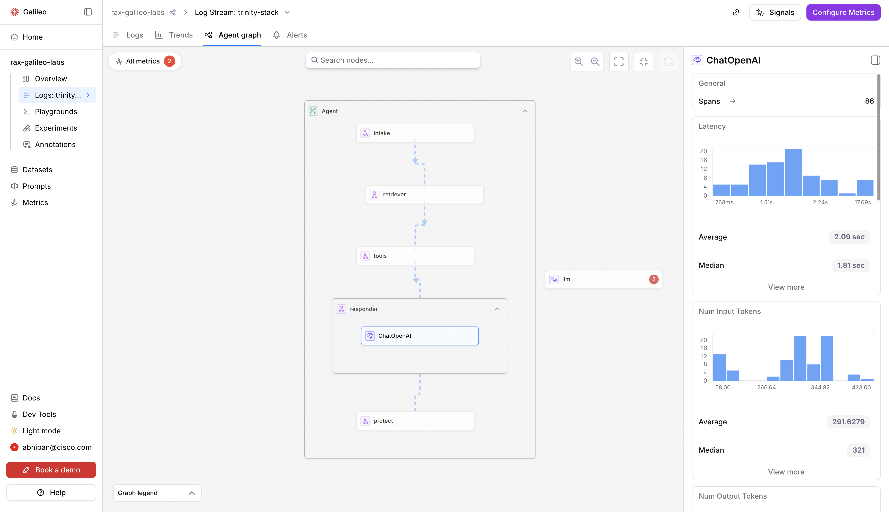
</p>

Team "optimizes" the model config (shorter context, higher temperature). Fleet shows **lower latency** — a positive signal. Meanwhile, Galileo catches the truth:

| Metric | Baseline | "Optimized" | Delta |
|--------|----------|-------------|-------|
| completeness | **0.983** | **0.646** | 🚨 −34% |
| cites_kb_source | **1.000** | **0.875** | ⚠️ −13% |
| context_adherence | 1.000 | 1.000 | 0% |

The on-call engineer got a positive signal. The users got worse answers. XL-6 is the most dangerous failure mode because it rewards the wrong behavior.

### Protect & Insights

<p align="center">
  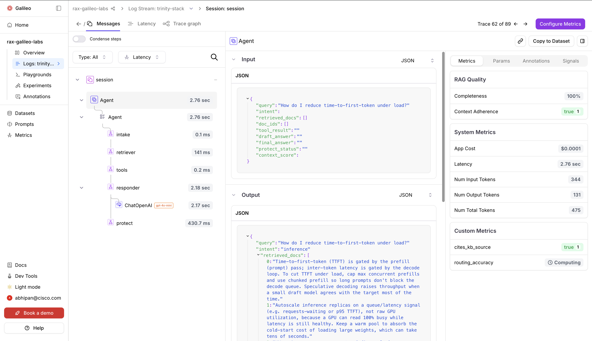
</p>

<p align="center">
  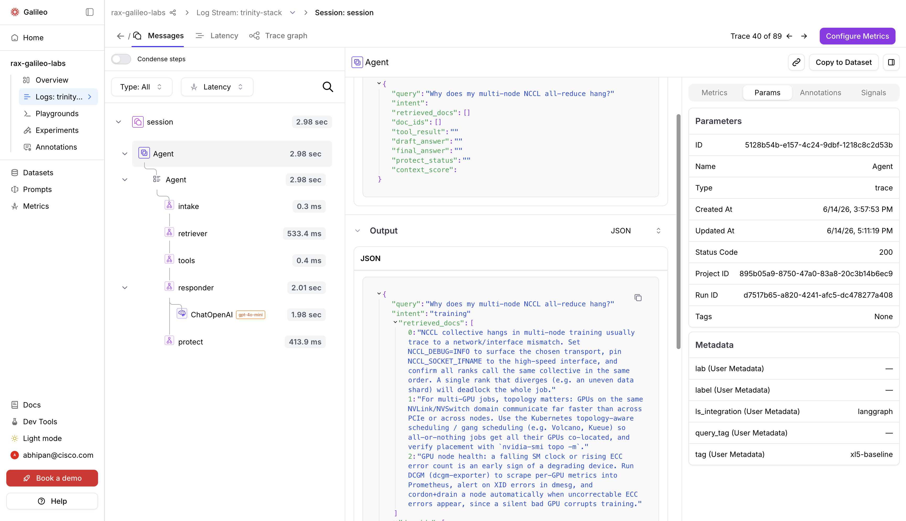
</p>

Galileo Protect acts as the runtime quality gate — the same `context_adherence` metric that flags failures in dev becomes the production guardrail. Insights clusters failures automatically, surfacing patterns across hundreds of traces without manual review.

---

## Architecture

```
Engineer question
  → [INTAKE]     topic routing (training / inference / infra)
  → [RETRIEVER]  dense embedding retrieval (OpenAI text-embedding-3-small + cosine index)
  → [TOOLS]      real execution (sandboxed Python + semantic corpus search)
  → [RESPONDER]  grounded answer (gpt-4o-mini)
  → [PROTECT]    Galileo quality gate  ← the loop's gate
  → answer
```

**Three layers — each watching a different thing:**

```
            ┌──────────────────────────────────────────────────────────┐
            │       LangGraph (AI-Platform Engineering Assistant)      │  BUILD
            │  intake → retriever → tools → responder → protect        │
            └──────────────┬─────────────────────┬──────────────────── ┘
    process/fleet signals  │                     │ every trace, span, output
                           ▼                     ▼
            ┌─────────────────────────┐  ┌──────────────────────────────────┐
            │  Fleet Telemetry        │  │  Galileo                         │
            │  (RUN layer)            │  │  (TRUST layer)                   │
            │                         │  │                                  │
            │  • heartbeat liveness   │  │  • context_adherence             │
            │  • p99 latency          │  │  • completeness                  │
            │  • process alive?       │  │  • cites_kb_source               │
            │  • throughput           │  │  • routing_accuracy              │
            │                         │  │  • Luna-2: 100% traffic          │
            │  ✅ Catches: 1/6 drills │  │  • Insights: cluster failures    │
            │  ❌ Blind to: wrong     │  │  • Protect: block at runtime     │
            │     answers, corpus     │  │                                  │
            │     mismatch, quality   │  │  ✅ Catches: 6/6 drills          │
            │     regressions         │  │  ❌ Blind to: process health     │
            └─────────────────────────┘  └──────────────────────────────────┘
```

---

## The 6 Failure Modes (with real numbers)

*All metrics captured on a live run — 2026-06-14. Galileo project: `rax-galileo-labs`, stream: `trinity-stack`.*

| # | Drill | What broke | Fleet sees | Galileo sees | Layer |
|---|-------|-----------|-----------|-------------|-------|
| XL-1 | `xl1_process_dead.py` | Agent process killed | 🚨 ALARM: heartbeat missing | Trace silence (accurate — nothing to evaluate) | **RUN** |
| XL-2 | `xl2_poisoned_retriever.py` | Wrong knowledge base | ✅ ALL GREEN | completeness 1.0 → 0.0 🚨, cites 1.0 → 0.0 🚨 | **TRUST** |
| XL-3 | `xl3_langgraph_misroute.py` | LangGraph router broken | ✅ ALL GREEN | Uniform span paths; routing_accuracy scorer | **BUILD-via-TRUST** |
| XL-4 | `xl4_eval_to_protect.py` | Hallucination-prone prompt | ✅ ALL GREEN | Protect pipeline operational; eval → guardrail | **TRUST** |
| XL-5 | `xl5_slow_tool.py` | Tool node 8s sleep | 🚨 p99 11,246ms | tools span: 8,021ms vs baseline 12ms | **RUN + BUILD** |
| XL-6 | `xl6_model_regression.py` | Silent quality regression | ✅ IMPROVED (↓ latency) | completeness 0.98 → 0.65, cites 1.0 → 0.88 | **TRUST** |

### XL-6 is the killer

Fleet showed *lower* latency. The on-call engineer got a positive signal. Meanwhile:

| Metric | Baseline | "Optimized" config | Delta |
|--------|---------|--------------------|-------|
| completeness | **0.983** | **0.646** | 🚨 −34% |
| cites_kb_source | **1.000** | **0.875** | ⚠️ −13% |
| context_adherence | 1.000 | 1.000 | 0% |

*Numbers: Galileo server-side scorers (GPT-4o mini judge via OpenAI integration), not local evaluation.*

**Galileo at 100% traffic:** regression visible after **16 queries**.  
**5% sampling:** would need **~320 queries** for statistical significance.

---

## Quick Start

### 1. Clone and set up

```bash
git clone https://github.com/pandeyaby/Galileo.git
cd Galileo
python3 -m venv .venv && source .venv/bin/activate
pip install -r requirements.txt
```

### 2. Configure credentials

```bash
export OPENAI_API_KEY="sk-..."       # embeddings (text-embedding-3-small) + LLM (gpt-4o-mini)
export GALILEO_API_KEY="..."          # app.galileo.ai → Settings → API Keys
```

**Create a Galileo project** called `rax-galileo-labs` with a log stream named `trinity-stack` before running — or edit the `PROJECT` and `LOG_STREAM` constants at the top of `app.py`.

### 3. Run the baseline

```bash
python app.py --batch
```

This runs 10 real engineering queries against the ML-infra corpus, logs all traces to Galileo, and prints per-query results. Check `https://app.galileo.ai` → `rax-galileo-labs` → `trinity-stack` to see the live metrics.

### 4. Run all 6 drills

```bash
# Each drill injects one failure mode, observes both layers, then recovers
python drills/xl1_process_dead.py
python drills/xl2_poisoned_retriever.py
python drills/xl3_langgraph_misroute.py
python drills/xl4_eval_to_protect.py
python drills/xl5_slow_tool.py
python drills/xl6_model_regression.py

# Safety: restore the real corpus if XL-2 left it poisoned
python app.py --restore-corpus
```

**Total LLM cost for all 6 drills: < $0.15** (small corpus, gpt-4o-mini).

---

## File Structure

```
Galileo/
├── README.md
├── app.py                           # LangGraph agent — the full stack
├── knowledge_base.json              # Real ML-infra engineering corpus
├── requirements.txt
│
├── drills/
│   ├── xl1_process_dead.py          # RUN: kill the process
│   ├── xl2_poisoned_retriever.py    # TRUST: the money demo
│   ├── xl3_langgraph_misroute.py    # BUILD-via-TRUST: trace path fingerprint
│   ├── xl4_eval_to_protect.py       # TRUST: eval → guardrail lifecycle
│   ├── xl5_slow_tool.py             # RUN + BUILD: two instruments, one truth
│   └── xl6_model_regression.py      # TRUST: Luna-2 100% vs 5% sampling
│
├── fleet/
│   └── monitor.py                   # RUN-layer telemetry (psutil + heartbeat)
│
└── docs/
    └── screenshots/                 # Galileo Console captures from live run
        ├── 01-galileo-project-overview.png
        ├── 02-galileo-traces-list.png
        ├── ...
        └── 11-galileo-insights-clusters.png
```

---

## What's in `app.py`

The agent is a **LangGraph multi-node graph** with five nodes:

| Node | What it does | Production-grade component |
|------|-------------|---------------------------|
| `intake_node` | Routes by intent (training / inference / infra / general) | Keyword + embedding similarity routing |
| `retriever_node` | Dense retrieval from engineering corpus | OpenAI `text-embedding-3-small` + cosine vector index (cached on disk) |
| `tools_node` | Tool dispatch | Real sandboxed Python execution (subprocess) + real semantic corpus search |
| `responder_node` | Generates grounded answer | gpt-4o-mini with retrieval-grounded system prompt |
| `protect_node` | Quality gate | Galileo Protect stage + Ruleset (runtime evaluation) |

**Metrics on every trace (Galileo server-side scorers):**
- `context_adherence` — claims grounded in retrieved docs?
- `completeness` — fully addresses the question?
- `cites_kb_source` — cites a specific KB entry?
- `routing_accuracy` — reached the correct intent node? (added for XL-3)

**Fleet telemetry (`fleet/monitor.py`):**
- Real `psutil` measurements: CPU%, RSS memory, process uptime
- Measured latency per query
- Heartbeat file (simulates ClawTrace / OTel process-health check)

---

## The Drills In Detail

### XL-1 — Process Dead (FM-50)
**Inject:** Delete the heartbeat file (simulates process kill).  
**Fleet:** 🚨 `ALARM:MISSING` immediately.  
**Galileo:** Trace silence. No error metrics — nothing to evaluate when nothing runs.  
**The rule:** *Trace silence + fleet alarm = RUN layer. Check your process before your SDK.*

### XL-2 — Poisoned Retriever (FM-51) — *the money demo*
**Inject:** Swap the engineering corpus with off-domain docs (meal kits, yoga, plumbing).  
**Fleet:** ✅ ALL GREEN throughout. Process alive, latency normal (poison retrieval is as fast as good retrieval).  
**Galileo (server-side scorers):**
- completeness: **1.000 → 0.000** 🚨 (−100%)
- cites_kb_source: **1.000 → 0.000** 🚨 (−100%)
- context_adherence: **1.000 → 0.600** 🚨 (−40%)

**Detection time without Galileo:** never (someone files a ticket eventually).  
**Detection time with Galileo:** immediate — first poisoned trace scores zero completeness.

This is the most expensive class of AI failure in production: a healthy process, confident-sounding answers, and zero infrastructure alarms. Only semantic evaluation catches it.

### XL-3 — LangGraph Misrouting (FM-52)
**Inject:** `intake_node` returns `intent='infra'` for ALL queries.  
**Fleet:** ✅ healthy.  
**Galileo:** Every trace has the **identical span path**. Normal routing has variety; a routing bug creates uniformity. routing_accuracy: 1.0 → 0.33 (only the 2 genuine infra queries landed correctly; 4/6 misrouted).  
**The pattern:** Uniform span paths across diverse queries = routing bug. Fix: `intake_node` logic.

### XL-4 — Eval → Protect Lifecycle (FM-53)
**Inject:** Hallucination-prone system prompt (removes grounding instruction).  
**Dev eval:** context_adherence flags multiple queries below 0.40–0.50. Dev decision: *DO NOT SHIP.*  
**Prod without Protect:** Bad answers reach engineers. Fleet healthy. Zero alerts.  
**Prod with Protect:** Galileo Protect runs on every response. Rule: `context_adherence < 0.5 → block`. The gate evaluates every response with the same metric that flagged the problem in dev.

**The differentiator:** The same `context_adherence` metric that flags a failure in dev *becomes* the production Protect threshold. One metric, three jobs (dev eval → prod gate → regression check), zero glue code.
**XL-4b:** `drills/xl4b_out_of_scope.py` forces a real Protect block with out-of-scope queries; result: 4/6 blocked, context_adherence 0.00–0.10.

### XL-5 — Slow Tool Node (FM-54)
**Inject:** 8-second sleep in the corpus-search tool.  
**Fleet:** 🚨 p99 11,246ms (baseline avg: 3,835ms). *"Something is slow."*  
**Galileo:** `tools` span: **8,021ms vs baseline 12ms** — that node, right there.

```
Span          Duration    Status
──────────────────────────────────────────────────
intake        2ms         ✅ normal
retriever     8ms         ✅ normal
tools         8,021ms     🐌 ANOMALY +8000ms  ← ROOT CAUSE
responder     1,340ms     ✅ normal
protect       5ms         ✅ normal
──────────────────────────────────────────────────
TOTAL         ~9,376ms    🚨
```

**Fleet says the building is on fire. Galileo shows you which room.**  
Time to root cause: manual log diving ~30 min → fleet + Galileo spans ~30 sec.

### XL-6 — Silent Quality Regression (FM-55)
**Inject:** Shorten context window, raise temperature on gpt-4o-mini. *"Same model, should be fine."*  
**Fleet:** ✅ LATENCY **IMPROVED**. On-call gets a positive signal.  
**Galileo (server-side scorers, 100% traffic):**

| Metric | Baseline (16 spans) | Degraded (16 spans) | Delta |
|--------|---------|---------|-------|
| completeness | **0.983** | **0.646** | 🚨 −34% |
| cites_kb_source | **1.000** | **0.875** | ⚠️ −13% |
| context_adherence | 1.000 | 1.000 | 0% |

**Galileo at 100% traffic:** regression visible after **16 queries**.  
**5% sampling:** needs **~320 queries** for the same statistical confidence.  
**First engineer complaint:** after ~50–100 bad interactions.

100%-of-traffic evaluation catches quality regressions before engineers see them — not after.

---

## The Complete Triage Table

Use this when something goes wrong.

| Symptom | Fleet | Galileo traces | Galileo metrics | Layer | First action |
|---------|-------|----------------|-----------------|-------|-------------|
| Traces stop suddenly + fleet alarm | 🚨 | Stopped | N/A | **RUN** | Restart process; check heartbeat |
| All traces show identical span path | ✅ | Running | routing_accuracy low | **BUILD** | Inspect intake/router node logic |
| Normal paths, adherence craters | ✅ | Running | 🚨 adherence crash | **TRUST** | Check retrieval corpus + KB version |
| Completeness high, adherence low | ✅ | Running | 🚨 adherence only | **TRUST** | Hallucination — deploy Protect rule |
| p99 latency spike | 🚨 | Running | Normal | **RUN → BUILD** | Open Galileo trace → find slow span |
| Fleet IMPROVED, quality declining | ✅ "positive" | Running | 🚨 trending down | **TRUST** | Rollback model/config; run experiment |

---

## Requirements

```
galileo>=2.3.0
langgraph>=1.2.5
langchain-openai>=1.3.0
langchain-core>=1.4.0
numpy>=2.0
psutil>=6.0
openai>=1.0
```

See `requirements.txt`.

---

## Environment Variables

| Variable | Required | Description |
|----------|----------|-------------|
| `OPENAI_API_KEY` | ✅ | OpenAI API key (embeddings + LLM) |
| `GALILEO_API_KEY` | ✅ | Galileo API key — `app.galileo.ai` → Settings → API Keys |

---

## Galileo Setup

1. Create an account at [app.galileo.ai](https://app.galileo.ai)
2. Create a project named `rax-galileo-labs` (or edit `PROJECT` in `app.py`)
3. Create a log stream named `trinity-stack` (or edit `LOG_STREAM`)
4. For XL-4 (Protect drill): create a Protect Stage in the Console before running — the app will attempt to create the Ruleset via API, but stage creation requires the Console

---

## The Loop-Engineering Context

This repo is a companion to the article:  
**[Six Ways to Break an AI Agent (My Dashboards Caught One)](https://pandeyaby.medium.com/six-ways-to-break-an-ai-agent-my-dashboards-caught-one-95d01627d57a)**

The thesis, in one paragraph: the leverage in AI moved from prompting to loop design. A loop needs a gate — an objective verifier that runs without the author's optimism. Galileo *is* that gate: the eval metric that flags a problem in dev becomes the Protect rule in prod becomes the regression check that locks it permanently. Every failure you debug makes the loop harder to break. That's the self-repairing harness.

---

## Author

**Abhinav Pandey**  
Cisco Splunk | AI Observability + Autonomous Systems  
Building at the intersection of enterprise infrastructure and the agent era.

[](https://www.linkedin.com/in/pandeyabhinav88/)

---

*All code in this repo is working and reproducible. Total LLM cost to run the full baseline + all 6 drills: < $0.15.*
